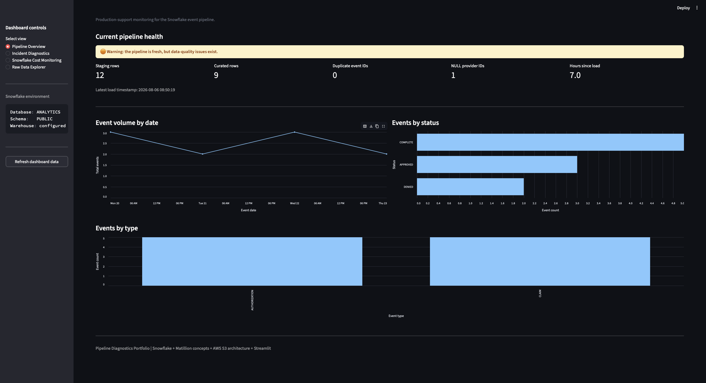

# Pipeline Diagnostics Portfolio
Production pipeline troubleshooting and incident-analysis project using
** Snowflake, Matillion concepts, SQL, and AWS S3 architecture patterns **.

Instead of demonstrating only how to build a data pipeline, this project focuses
on another important Data Engineering skill:

<!-- Diagnosing, troubleshooting, and safely resolving production pipeline failures. -->

The project contains five realistic production incidents modeled after the type
of troubleshooting encountered when supporting existing Matillion, Snowflake,
and AWS data pipelines.

## Architecture
AWS S3 -> Matillion Orchestration -> Snowflake Staging Layer -> Transformation -> Curated Layer -> Analytics / Downstream Consumers

## Technology Stack
| Technology | Purpose |

| Snowflake | Cloud data warehouse |
| SQL | Transformation and diagnostics |
| Matillion | Pipeline orchestration concepts |
| AWS S3 | Source file / landing architecture |
| Git | Source control |
| GitHub | Portfolio and documentation |
| VS Code | Development environment |


## Project Objective
A production pipeline may fail in many ways.

Some failures produce an obvious error.

Others are more dangerous because the pipeline technically succeeds while
producing incomplete, duplicated, stale, or incorrect data.

This project demonstrates how I approach those situations using the following
incident-analysis framework:

Symptom -> Diagnostic Process -> Root Cause -> Fix -> Validation -> Prevention

# Healthy Baseline Pipeline
Before introducing failures, a known-good pipeline is established.

staging_events -> aggregation transformation -> curated_daily_events

The baseline allows expected behaviour to be compared with failed states.

SQL:
[Baseline Setup](sql/00_baseline_setup.sql)

[Sample Data](sql/01_sample_data.sql)

[Healthy Transformation](sql/02_healthy_transformation.sql)


# Production Incidents

## Incident 01 — Duplicate Batch Load

**Symptom:** Curated event counts were approximately double the expected values.

**Root Cause:** The same source batch was processed twice.

**Diagnostic technique:**

```sql
SELECT
    event_id,
    COUNT(*)
FROM staging_events
GROUP BY event_id
HAVING COUNT(*) > 1;
```

**Engineering lesson:** Validate upstream grain and uniqueness before changing
downstream transformation logic.

[View full incident report](sql/incidents/incident_01_duplicate_load.md)


## Incident 02 — NULL + NOT IN Silent Failure

**Symptom:** An exclusion query unexpectedly returned zero rows.

**Root Cause:** A NULL inside a `NOT IN` subquery caused SQL three-valued logic
to invalidate the comparison.

**Fix:** Replace `NOT IN` with `NOT EXISTS`.

[View full incident report](sql/incidents/incident_02_null_not_in.md)


## Incident 03 — Silently Stale Pipeline

**Symptom:** Data looked correct but had not refreshed.

**Root Cause:** The scheduled pipeline never started.

**Diagnostic technique:**

```sql
SELECT MAX(loaded_at)
FROM staging_events;
```

**Engineering lesson:** "No error" does not guarantee that a pipeline ran.

[View full incident report](sql/incidents/incident_03_stale_pipeline.md)


## Incident 04 — Data-Type Mismatch

**Symptom:** A join returned fewer records than expected without producing an
error.

**Root Cause:** `provider_id` was stored using inconsistent data types between
sources.

**Engineering lesson:** Validate schema and data types before debugging complex
join logic.

[View full incident report](sql/incidents/incident_04_type_mismatch.md)


## Incident 05 — Snowflake Cost Spike

**Symptom:** Unexpected warehouse compute usage.

**Root Cause:** A pipeline reran without its normal incremental filter and
processed substantially more data than intended.

**Prevention:**

- Snowflake resource monitors
- query monitoring
- incremental processing
- workload isolation
- cost alerts

[View full incident report](sql/incidents/incident_05_cost_spike.md)

# Troubleshooting Philosophy
When troubleshooting an unfamiliar production pipeline, I generally work from
the simplest assumptions outward:

1. Did the pipeline actually run?
2. Did the expected source data arrive?
3. Is the data fresh?
4. Is the source row count reasonable?
5. Are business keys unique?
6. Are NULL values affecting logic?
7. Are JOIN keys using compatible data types?
8. Did a retry/restart process data more than once?
9. Did the transformation produce the expected grain?
10. Did resource consumption change unexpectedly?

This avoids changing transformation logic before determining whether the
actual failure occurred upstream.

# Key Skills Demonstrated
- Production pipeline troubleshooting
- Root-cause analysis
- Snowflake SQL
- Data-quality investigation
- Duplicate detection
- NULL handling
- JOIN debugging
- Pipeline freshness monitoring
- Snowflake cost analysis
- Incident documentation
- Preventive engineering
- Git / GitHub workflow

# Streamlit Diagnostics Dashboard
The project includes an interactive Streamlit dashboard connected to Snowflake.

The dashboard converts the incident investigations into reusable monitoring
views.

## Dashboard Capabilities
- Pipeline freshness and SLA monitoring
- Staging and curated row counts
- Duplicate business-key detection
- NULL provider-ID detection
- Unmatched provider lookup detection
- Event-volume trends
- Event status and type distributions
- Snowflake warehouse-credit monitoring
- Expensive-query analysis
- Raw-data filtering and CSV export

## Dashboard Preview


## Run Locally
Create and activate a Python environment:

```bash
python3 -m venv .venv
source .venv/bin/activate
```

Install dependencies:

```bash
pip install -r requirements.txt
```

Create a local Snowflake connection file:

```text
.streamlit/secrets.toml
```

Run the application:

```bash
streamlit run streamlit_app.py
```

## Security
The Snowflake connection file is excluded from Git through `.gitignore`.
No credentials or production data are stored in this repository.