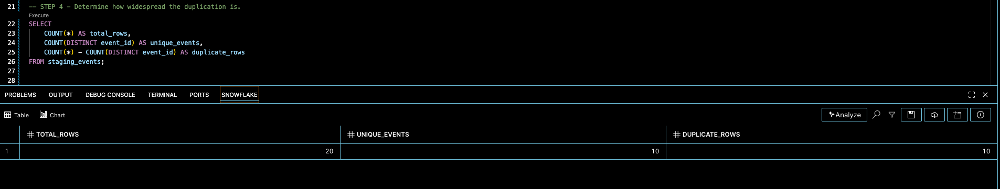
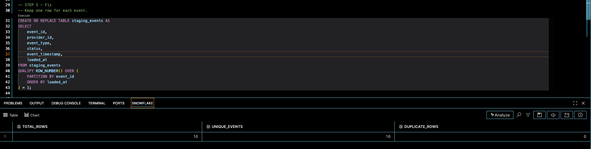

# Incident 01 — Duplicate Batch Load

## Overview
A simulated production pipeline produced inflated event counts after the same
source batch was processed more than once.

The scenario represents a common production-support problem where an
orchestration job is restarted without sufficient idempotency or load tracking.

## Symptom
The curated table showed event counts significantly higher than expected.

Initial observation:
<!-- sql -->
SELECT COUNT(*) FROM staging_events;

The expected source contained 10 events, but the staging table contained 20.

## Diagnostic Process

### 1. Confirm row-count anomaly
<!-- sql -->
SELECT COUNT(*) AS total_rows FROM staging_events;

### 2. Check duplicate event IDs
<!-- sql -->
SELECT
    event_id,
    COUNT(*) AS duplicate_count
FROM staging_events
GROUP BY event_id
HAVING COUNT(*) > 1;

Every `event_id` appeared twice.

### 3. Compare physical rows with business keys
<!-- sql -->
SELECT
    COUNT(*) AS total_rows,
    COUNT(DISTINCT event_id) AS unique_events
FROM staging_events;

This confirmed that the problem originated in ingestion rather than the
downstream aggregation.

## Root Cause
The simulated Matillion ingestion job processed the same batch twice.

The pipeline did not have a mechanism to identify whether the source batch had
already been processed.

## Fix
Deduplicate the staging table using the event business key:

<!-- sql -->
CREATE OR REPLACE TABLE staging_events AS
SELECT
    event_id,
    provider_id,
    event_type,
    status,
    event_timestamp,
    loaded_at
FROM staging_events
QUALIFY ROW_NUMBER() OVER (
    PARTITION BY event_id
    ORDER BY loaded_at
) = 1;

## Validation
<!-- sql -->
SELECT
    event_id,
    COUNT(*)
FROM staging_events
GROUP BY event_id
HAVING COUNT(*) > 1;

Expected:
<!-- text 0 rows returned -->

## Prevention
A production implementation should use:
- batch/load identifiers
- idempotent ingestion
- duplicate detection
- load-control/audit tables
- MERGE-based ingestion where appropriate

For example, a `load_batch_id` could be checked before processing a new S3
object.

## Engineering Lesson
A downstream aggregation returning incorrect counts does not necessarily mean
the aggregation is wrong.

Validate the upstream grain and uniqueness before changing transformation
logic.

## Before Fix

## After Fix
